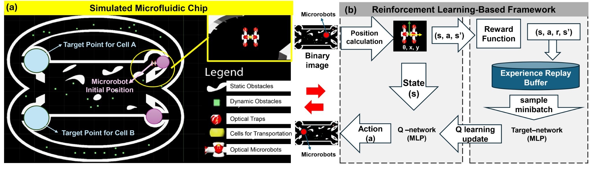
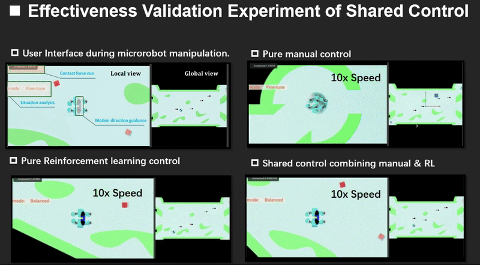

# Digital Twin ROS 2 RL Navigation for Optical Microrobots

This repository provides a ROS 2 reimplementation of the digital-twin and reinforcement-learning navigation workflow for optical-tweezers-driven microrobot simulation in NVIDIA Isaac Sim. The current version focuses on the digital-twin simulator, ROS 2 communication, and a trained DQN navigation controller.



## 1. Pipeline Overview

The system uses Isaac Sim as the digital-twin environment and a Python ROS 2 node as the high-level RL controller.

```text
Isaac Sim USD scene
  ├─ publishes simulated states through ROS 2:
  │    /object, /xform, /robot01, /robot02, /DynaOb*, ...
  │    message type: tf2_msgs/msg/TFMessage
  │
  └─ subscribes to RL control commands:
       /rl_vel       geometry_msgs/msg/Twist
       /resetSignal  geometry_msgs/msg/Twist

Python ROS 2 DQN controller
  ├─ reads the planned trajectory from data/smoothed_path.csv
  ├─ loads the trained DQN weights from models/best_model_750.pth
  ├─ computes the RL action and trajectory-following velocity
  └─ publishes velocity/reset commands back to Isaac Sim
```

A representative rollout is shown below.



## 2. Repository Structure

```text
.
├── README.md
├── requirements.txt
├── assets/
│   ├── framework_ros2_rl.jpg          # overview figure used in this README
│   ├── shared_control_validation.gif  # demo visualization
│   └── demo_video.mp4                 # optional video asset
├── data/
│   └── smoothed_path.csv              # planned trajectory used by the controller
├── docs/
│   └── TROUBLESHOOTING.md             # common ROS 2 / Isaac Sim issues
├── isaac/
│   └── 260425ROS2ForSharedControlExperiment.usd
├── models/
│   └── best_model_750.pth             # trained DQN weights
├── rl_navigation/
│   ├── __init__.py
│   ├── dqn_model.py                   # DQN network definition
│   ├── ros2_env.py                    # ROS 2 topic interface and Gym-style environment
│   ├── deploy_best_model.py           # main deployment script
│   └── data_logger.py                 # optional rollout logger
└── scripts/
    ├── setup_venv_foxy.sh             # creates the Python 3.8 ROS 2 Foxy venv
    ├── run_deployment.sh              # convenience launcher
    └── check_ros2_topics.sh           # topic debugging helper
```

## 3. Code Mapping

| Component | File | Role |
|---|---|---|
| Isaac Sim scene | `isaac/260425ROS2ForSharedControlExperiment.usd` | Digital-twin microfluidic environment with ROS 2 Action Graph nodes. |
| Planned path | `data/smoothed_path.csv` | Stores the smoothed trajectory used by the controller. |
| Trained model | `models/best_model_750.pth` | DQN weights used during deployment. |
| DQN model | `rl_navigation/dqn_model.py` | Fully connected Q-network and action-selection wrapper. |
| ROS 2 environment | `rl_navigation/ros2_env.py` | Subscribes to Isaac Sim states, computes trajectory-following commands, and publishes `/rl_vel` / `/resetSignal`. |
| Deployment entry point | `rl_navigation/deploy_best_model.py` | Loads the model, starts the ROS 2 node, waits for Isaac states, and runs deployment. |
| Optional logger | `rl_navigation/data_logger.py` | Records key state topics to CSV. |

## 4. Requirements

Tested target setup:

- Ubuntu 20.04
- ROS 2 Foxy
- NVIDIA Isaac Sim 2023.1.1
- Python 3.8 for the external ROS 2 controller
- Python packages listed in `requirements.txt`
- PyTorch CPU wheel for quick deployment validation

Important note: run the Python ROS 2 controller with a ROS 2 Foxy Python 3.8 environment, not with Isaac Sim's `python.sh`. Isaac Sim's bundled Python and ROS 2 Foxy's `rclpy` can use different Python ABIs, which causes `_rclpy` import errors.

## 5. Quick Start

### Step 1 — Clone or unzip the repository

If you downloaded the ZIP:

```bash
unzip digital-twin-ros2-rl-navigation.zip
cd digital-twin-ros2-rl-navigation
```

If you cloned from GitHub:

```bash
git clone https://github.com/YOUR_USERNAME/digital-twin-ros2-rl-navigation.git
cd digital-twin-ros2-rl-navigation
```

### Step 2 — Create the ROS 2 Foxy Python environment

```bash
bash scripts/setup_venv_foxy.sh
```

Then activate it:

```bash
source ~/venvs/ros2foxy_rl/bin/activate
source /opt/ros/foxy/setup.bash
```

Check the environment:

```bash
python -c "import rclpy, torch, gym, numpy; from geometry_msgs.msg import Twist; from tf2_msgs.msg import TFMessage; print('ALL OK')"
```

Expected output:

```text
ALL OK
```

The warning from `gym` about Gymnasium can be ignored for this deployment because the current code uses the original `gym` API.

### Step 3 — Launch Isaac Sim with ROS 2 sourced

Open a new terminal:

```bash
source /opt/ros/foxy/setup.bash
export RMW_IMPLEMENTATION=rmw_fastrtps_cpp
/home/jerry/.local/share/ov/pkg/isaac-sim-2023.1.1/isaac-sim.sh
```

In Isaac Sim:

1. Enable the ROS 2 Bridge extension.
2. Make sure the ROS 1 Bridge is disabled.
3. Open `isaac/260425ROS2ForSharedControlExperiment.usd`.
4. Press **Play** on the Timeline.
5. Confirm the ROS 2 Action Graph is publishing the state topics.

### Step 4 — Check ROS 2 topics

In another terminal:

```bash
cd digital-twin-ros2-rl-navigation
bash scripts/check_ros2_topics.sh
```

At minimum, these topics should exist and publish non-empty messages:

```text
/object      tf2_msgs/msg/TFMessage
/xform       tf2_msgs/msg/TFMessage
/robot01     tf2_msgs/msg/TFMessage
/robot02     tf2_msgs/msg/TFMessage
/rl_vel      geometry_msgs/msg/Twist
/resetSignal geometry_msgs/msg/Twist
```

For a direct check:

```bash
source /opt/ros/foxy/setup.bash
ros2 topic echo /xform --once
ros2 topic echo /object --once
```

Both commands should print a non-empty `transforms:` list with `translation.x`, `translation.y`, and `translation.z`.

### Step 5 — Run the DQN deployment

From the repository root:

```bash
source ~/venvs/ros2foxy_rl/bin/activate
source /opt/ros/foxy/setup.bash
python rl_navigation/deploy_best_model.py
```

Or use the convenience script:

```bash
bash scripts/run_deployment.sh
```

You should see control logs similar to:

```text
[INFO] Loading model from: .../models/best_model_750.pth
Path loaded from CSV file: .../data/smoothed_path.csv; points=2746; first=(1.9933, -15.0016), last=(9.9525, -11.1120)
Received initial Isaac Sim topics: xform=[...], object=[...]
Reset finished. xform=[...], object=[...]
[CTRL] idx 0->10, action=..., cur=(...), target=(...), d=(...), cmd=(...)
```

## 6. Optional Commands

Run for only 100 control steps:

```bash
python rl_navigation/deploy_best_model.py --max-steps 100
```

Force CPU inference:

```bash
python rl_navigation/deploy_best_model.py --cpu
```

Use a custom path or model:

```bash
python rl_navigation/deploy_best_model.py \
  --csv data/smoothed_path.csv \
  --model models/best_model_750.pth
```

Log a rollout:

```bash
source ~/venvs/ros2foxy_rl/bin/activate
source /opt/ros/foxy/setup.bash
python rl_navigation/data_logger.py --output logs/rollout.csv --rate 5
```

## 7. Safety Checks Added in the ROS 2 Version

The ROS 2 version keeps the original trajectory/action calculation but adds safeguards to avoid stale-state runaway:

1. The deployment script refuses to move until `/object`, `/xform`, `/robot01`, and `/robot02` have been received.
2. The environment no longer clears cached positions to zero during reset.
3. After reset, it waits for fresh `/xform` and `/object` messages.
4. If `/xform` is still `[0, 0]`, motion is refused because the controller would otherwise compute a large fixed-direction velocity.
5. Linear and angular velocity commands are clipped as a final safety guard.

## 8. ROS 2 Topic Interface

### Isaac Sim → Python controller

| Topic | Type | Used for |
|---|---|---|
| `/object` | `tf2_msgs/msg/TFMessage` | Object/cell position, contact force, lost/collision flags encoded in rotation fields. |
| `/xform` | `tf2_msgs/msg/TFMessage` | Main robot or controlled transform pose used for path tracking. |
| `/robot01` | `tf2_msgs/msg/TFMessage` | First microrobot pose. |
| `/robot02` | `tf2_msgs/msg/TFMessage` | Second microrobot pose. |
| `/DynaOb01`–`/DynaOb04` | `tf2_msgs/msg/TFMessage` | Dynamic obstacle positions. |
| `/DynaOb01Collide`–`/DynaOb04Collide` | `tf2_msgs/msg/TFMessage` | Collision states and forces. |
| `/firstOTposition` | `tf2_msgs/msg/TFMessage` | Optional optical tweezer position for logging. |
| `/secondOTposition` | `tf2_msgs/msg/TFMessage` | Optional optical tweezer position for logging. |

### Python controller → Isaac Sim

| Topic | Type | Used for |
|---|---|---|
| `/rl_vel` | `geometry_msgs/msg/Twist` | RL velocity command. Uses `linear.x`, `linear.y`, and `angular.z`. |
| `/resetSignal` | `geometry_msgs/msg/Twist` | Reset command. Uses `angular.x` as the reset flag. |

## 9. Uploading This Repository to GitHub

### Method A — Upload through the GitHub website

1. Log in to GitHub.
2. Click **New repository**.
3. Name it, for example: `digital-twin-ros2-rl-navigation`.
4. Keep it public or private as needed.
5. Do not initialize with another README if you want to use this README directly.
6. Upload all files from this folder.
7. Commit the upload.

### Method B — Push from terminal

Create an empty repository on GitHub first. Then run:

```bash
cd digital-twin-ros2-rl-navigation

git init
git add .
git commit -m "Add ROS 2 digital twin RL navigation demo"
git branch -M main
git remote add origin https://github.com/YOUR_USERNAME/digital-twin-ros2-rl-navigation.git
git push -u origin main
```

The included USD file is about 34 MB, so it is below GitHub's hard single-file limit. If you later add larger videos, datasets, or USD assets, use Git LFS.

## 10. Citation / Acknowledgement

If you use this repository, please cite the corresponding project or paper once it is available.
